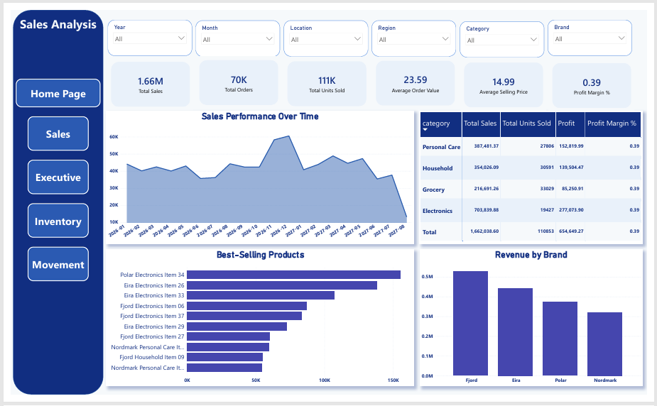
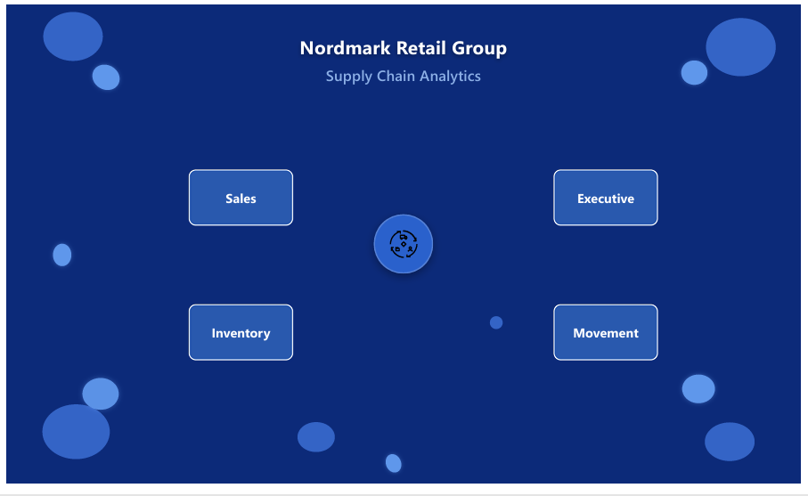
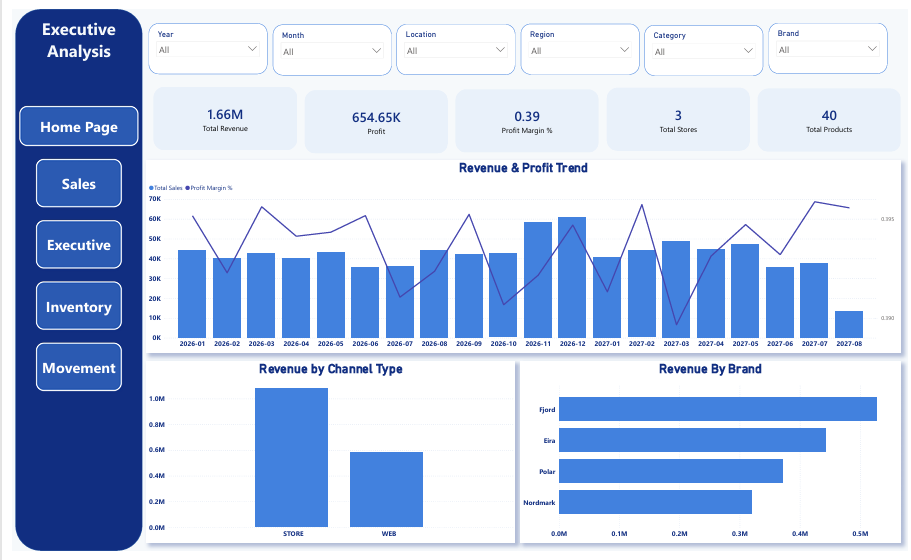
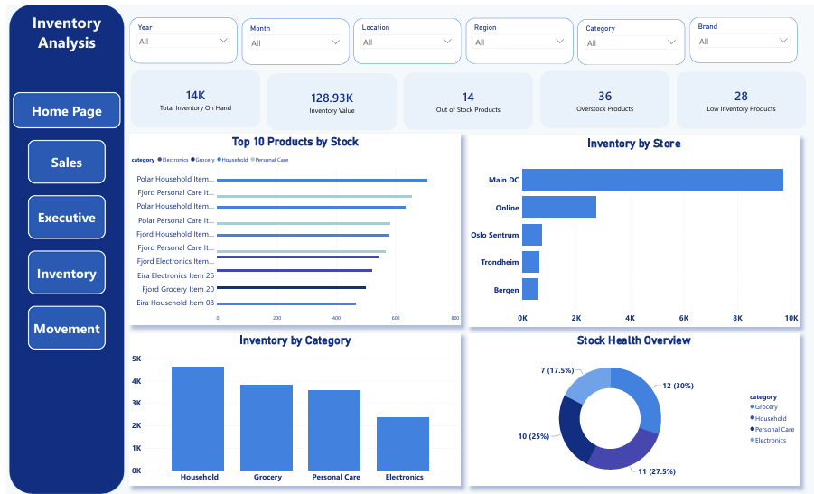
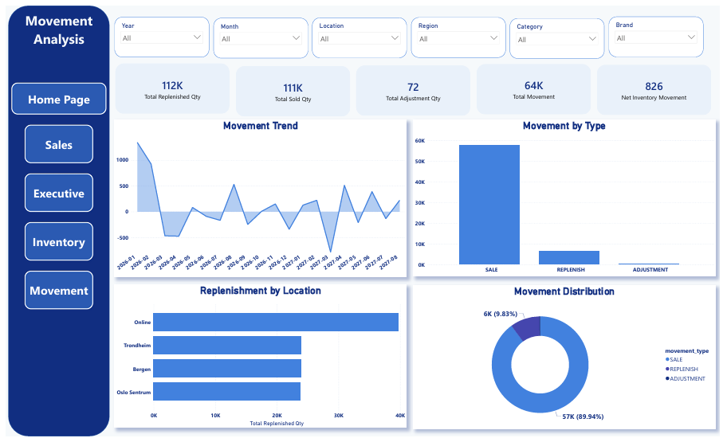

# Supply Chain Animation Video
)

# Nordmark Retail Group — Supply Chain Analytics Dashboard

A Power BI dashboard project analyzing supply chain performance for **Nordmark Retail Group**, a mid-sized European omnichannel retailer selling home goods, lifestyle, and seasonal merchandise across physical stores and a growing e-commerce channel. The project transforms raw operational data — daily inventory snapshots, individual sales transactions, and inventory movements — into actionable insights across five interactive report pages.

## 📌 Business Context

Nordmark's supply chain is a multi-node network: **Suppliers → Distribution Center (DC) → Stores / Web → Customers**. The same stock serves both the physical and online channels simultaneously, which significantly increases operational complexity.

The business is generating large volumes of operational data but struggles to translate it into timely decisions. Five core problems drive this project:

- **Stockout** — products run out at one location even though inventory is available elsewhere, causing lost sales and reduced customer trust
- **Overstock** — excess inventory sitting unsold, tying up working capital and creating markdown risk
- **Poor forecasting** — errors are discovered after the damage is done; feedback loops into planning are weak
- **Channel misalignment** — store and e-commerce teams operate independently, so inventory isn't distributed optimally
- **Reactive decisions** — teams make emergency reallocations instead of planning ahead

This dashboard was built to help the business move from a company that **reacts** to a company that **plans**.

## 🎯 Business Questions Answered

1. Where and when does inventory run low or out of stock?
2. Which SKUs and locations drive the most sales volume and revenue?
3. Which SKUs consistently carry more stock than demand requires?
4. How often does replenishment happen, and for which SKUs/locations?
5. Do inventory movements broadly align with sales and snapshot data?

## 📊 Dashboard Pages

### 🏠 Home Page
Visual landing page with project branding and one-click navigation to every report page.

### 💰 Sales Analysis
Sales performance over time, category and brand breakdowns, and the top 10 best-selling products by revenue.

### 🏆 Executive Analysis
High-level KPIs for leadership — total revenue, profit margin, and a direct comparison of in-store vs. online channel performance to surface channel misalignment.

### 📦 Inventory Analysis
The core operational page — current stock levels by store, category-level inventory, top products by stock, and a stock health overview flagging overstock, low inventory, and out-of-stock counts.

### 🚚 Movement Analysis
Replenishment, sales, and adjustment movement trends over time, movement volume by type, and replenishment frequency by location.

## 🗂️ Data Model

- **Fact tables:** `sales_transactions`, `inventory_snapshots`, `inventory_movements`
- **Dimension tables:** `product_master`, `location_master`, `dim_date`
- Star schema with a shared calendar table (`dim_date`) linking all fact tables via active/inactive relationships

## 🛠️ Tools Used

- **Power BI Desktop** — data modeling, DAX measures, report design
- **Power Query** — data transformation and cleaning
- **DAX** — custom measures for KPIs, stock health classification, and inventory turnover

## 🔑 Key Measures

- Total Inventory On Hand, Inventory Value, Stockout Rate %
- Total Sales, Profit Margin %, Average Order Value, Average Selling Price
- Total Replenished / Sold / Adjustment Qty, Net Inventory Movement
- Inventory Turnover, Days Inventory Outstanding (DIO)

## 🧩 Technical Challenges Solved

- **Time-context bugs in DAX:** several measures were initially summing inventory quantities across the *entire* 3-year dataset instead of a single snapshot date, producing inflated and meaningless KPIs (e.g., an Inventory Turnover of 65 instead of a realistic single-digit figure). Fixed by filtering on `MAX(snapshot_date)` and annualizing cost correctly.
- **Custom calendar table:** built a `dim_date` table covering the full 2026–2028 dataset period, with `Sort by Column` applied so month labels render in true chronological order instead of alphabetical.
- **Multiple relationships to one dimension:** `inventory_movements` has both a `from_location_id` and `to_location_id`; resolved with an inactive relationship and `USERELATIONSHIP()` to correctly attribute replenishment quantities to their destination location rather than the distribution center they originated from.
- **Visual design decisions:** deliberately avoided dense 40-row tables and treemaps in favor of horizontal bar charts, Top-N filtering, and donut summaries to reduce cognitive load — every chart type was chosen to answer a specific business question, not just to look different.

## 🚀 How to Use

1. Download the `.pbix` file from this repository
2. Open it with Power BI Desktop
3. Explore each page using the navigation sidebar, page slicers, and cross-filtering

## 📈 Project Objectives

| Horizon | Objective | Success Metric |
|---|---|---|
| Short-term (0–6 months) | Stop emergency reallocations, reduce stockouts, stabilize the replenishment cycle | Fewer stockout incidents per week |
| Mid-term (6–18 months) | Improve forecast accuracy, inventory efficiency, and store/online coordination | Higher inventory turnover rate |
| Long-term (18+ months) | Build a resilient supply chain able to absorb demand shocks and scale with growth | Lower operational cost per unit |

## 👥 Intended Users

| Role | Focus |
|---|---|
| Supply Chain Manager | Service levels, product availability, inventory efficiency |
| Inventory Planner | Replenishment plans, stock monitoring across locations |
| Retail Operations Lead | Store performance, recurring branch-level issues |
| E-commerce Lead | Online product availability, replenishment speed |
| Finance / Commercial Analyst | Revenue impact of inventory decisions, asset value of stock |

---

*This is a portfolio project built to demonstrate end-to-end Power BI development: data modeling, DAX, and business-driven dashboard design.*
